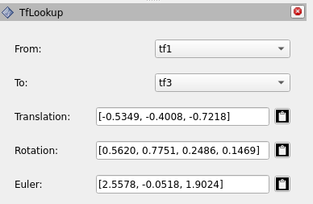

# rviz2_tf_transform_lookup

This repository provides an implementation to quickly visualzie/acquire tf2 transformation values in Rviz2.

## Description

The project is built to create a user friendly custom plugin which helps the users to select any two given frames and visualize the transform data between the selected frames. We use a simple tf2 buffer and tf2 listener to get the frame names and to look up the transform values (translation, totation, euler value) betweeen them. The values dynamically updates at a rate of 5 Hz. 

---
    
This project was developed by [Gokhul Raj Ravikumar](https://github.com/Gokhulraj6200) at [Fraunhofer IIS/EAS](https://www.eas.iis.fraunhofer.de/).

## Table of Contents
1. [Installation](#installation)
   - [Prerequsit](#prerequsit)
   - [Cloning the Repository](#cloning-the-repository)
   - [Installing dependencies with rosdep](#installing-dependencies-with-rosdep)
2. [Building the Project](#building-the-project)
3. [Usage](#usage)
   - [How to add the panel](#how-to-add-the-panel)

---

## Installation

Before using the project, ensure you have a ROS2 (Humble) environment set up on your system.

### Prerequsit

1. ROS2 Humble.
2. Rviz2.

### Cloning the Repository
1. Navigate to src folder in your directory:
    ```bash
    cd ~/ros2_ws/src
    ```
2. clone this package:
    ```bash
    git clone https://github.com/Fraunhofer-IIS/rviz2_tf_transform_lookup.git
    ```
### Installing Dependencies with rosdep

Run the following command to install all the dependencies defined for this package:

```bash
rosdep update
rosdep install --from-paths src --ignore-src -r -y
```

## Building the project

Once the dependencies are installed, you can build the project using `colcon`.

1. Navigate to your workspace directory:
    ```bash
    cd ~/ros2_ws
    ```

2. Build the workspace:
    ```bash
    colcon build --symlink-install
    ```
3. After the build is complete, source your workspace:
    ```bash
    source install/setup.bash
    ```
## Usage

### How to add this custom panel to RViz2


Follow the steps below to add the custom panel to your RViz2 interface:

1. Launch RViz2:
    ```bash
    ros2 run rviz2 rviz2
    ```

2. In RViz2, go to `Panels` in the top menu bar and select `Add New Panel`.

3. Then choose the plugin panel(`TfLookup`) which will be under the rviz2_tf_transform_lookup folder.

4. The panel should now appear in your RViz2 window. yiu can save the config for convenience.

5. select the From (`TF_Frame_1`) and to (`TF_Frame_2`) according to your choice to visualize the transform values.

6. The copy button next to each value fields can be enabled with a click, it copies the displayed transform values to the clipboard.
